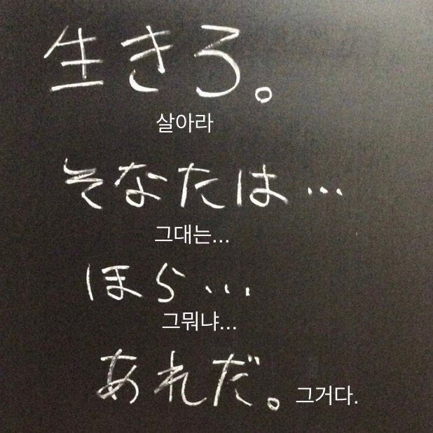

# 두 번째 회고

## 살아라. 그대는... 그뭐냐... 그거다.

---

벌써 _3주_ 차에 접어드는 시점이지만, 아직도 _9 to 6_ 수업을 소화하는 게 버겁다.

계획했던 운동도, 공부도 의욕만큼 하지 못하고 있다.

그래도 차차 적응해 가면서 운동도 꾸준히 하고,  
비전공자라 부족한 개발 공부도 부지런히 이어가야겠다는 생각을 하는 요즘이다.

다만 좀처럼 밤에 잠을 잘 이루지 못해서 수업 중 조는 일이 잦은 게 아쉽다.  
그래서 첫 번째 목표는 밤에 잘 자고, 수업 시간에 덜 조는 것이다.

| To do list |
:-------------
| 밤에 잘 자기 |

:-------------

| 수업 중에 집중하기 |

---

나는 열심히 하는 타인을 보면 자극을 받아 덩달아 열심히 하게 되는 성향이라,  
혼자 공부하는 것보다 함께 공부하는 게 원동력이 되고 더 좋다.  
그래서 밤에 디스코드 스터디룸 채널에 모여 공부하는 시간이 소소하게 즐겁다.

---

이제 _HTML_ 파트를 지나 *CSS*를 하고 있는데, 점점 더 재미있어지고 있다.  
물론 알고 있는 내용도 있지만, 가물가물하거나 새로 배우는 부분도 있어서 흥미롭다.  
뒤로 갈수록 더 재미있어질 거라는 기대에 _자바스크립트, 리액트_ 파트도 기다려진다.
