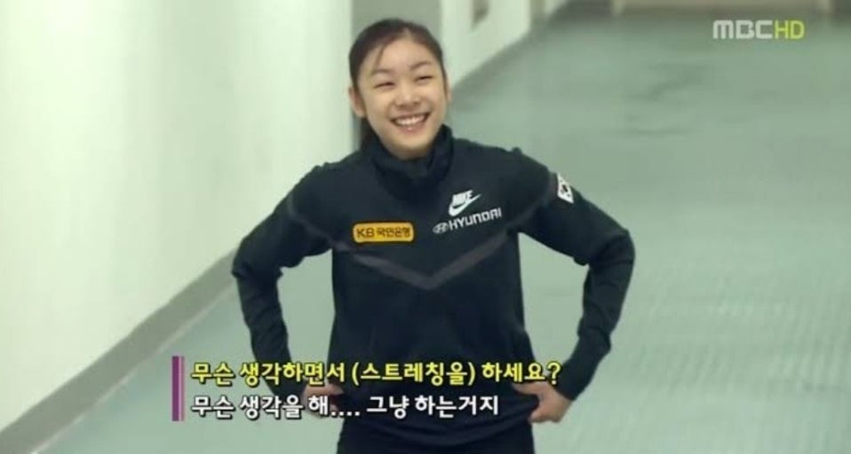

# 두 번째 회고

## 살아라. 그대는... 그뭐냐... 그거다.

---

멋쟁이 사자처럼 프론트엔드 부트캠프 과정을 시작한지 *약 3주*가 지나는 시점이다.
**HTTP 스터디**도 참여하고, **1일 1운동 챌린지**도 하고 있지만...
아직은 _9to6_ 수업만 듣는 것도 아직 적응이 덜 됐는지, 6시 땡 하면 죽을 것 같아 뻗기 일쑤다.

하지만...

그래도 **취뽀**를 위해선 견뎌야지...
그냥 하자...

수업듣는게 어느정도 적응이 되면 운동도 열심히 해야할 것 같다.
왜냐면 벌써 온몸 이곳저곳이 쑤시기 시작했다.
아직 개발자도 아닌데 직업병부터 얻을 순 없으니 운동을 하자(언젠간)

수업은 CSS 파트로 넘어와 진행 중인데, 예전에 이미 배웠지만 가물가물한 내용도 있고,
미처 알지 못 했던 내용도 있어서 집중해서 들어야 할 것 같다.

그러려면 **잠을 잘 자자** (만성 수면장애 ing...)

그래도 HTML을 지나 CSS로 넘어오니까 훨씬 재밌어서 오늘(8/29)은 덜 졸았다.
자바스크립트와 리액트 파트가 기대된다. (미래의 나: 어리둥절)
