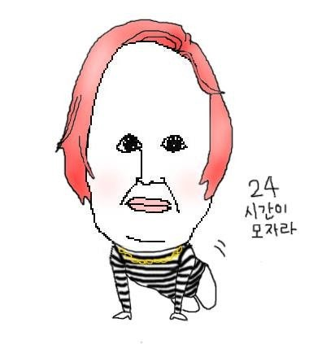

# 세 번째 회고

## 24시간이 모자라... (째깍째깍)

이전에 배운 적 없는 flex라던지, 새로운 개념들을 배우면서 재미를 느끼기도 하지만, 요즘은 공부하느라 시간이 많이 부족하다는 걸 자주 느낀다.  
나도 열심히 하고 있지만, 주변에서 다들 열심히 노력하는 게 보여서 긴장을 늦출 수가 없다.
그만큼 자극을 받아 나도 더 열심히 해야겠다는 생각이 든다.
주말에도 마음 편히 놀 시간은 없겠구나 하는 걸 체감했고, 그래서 주말을 더 알차게 활용해야겠다고 다짐했다.
